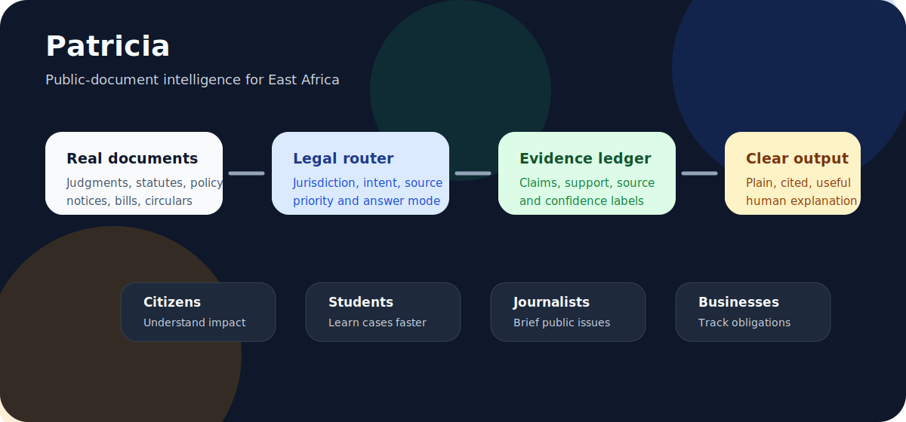
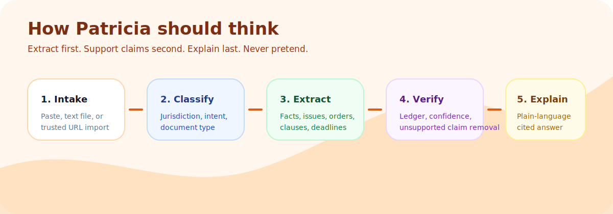

<p align="center">
  
</p>

# Patricia

**Patricia is an East African public-document intelligence assistant.**

It helps people read, question, simplify, brief, and verify legal, policy, civic, court, and government material without pretending to be a lawyer or a fake legal database.

Patricia should become the tool that takes documents most people avoid — judgments, laws, policies, county notices, bills, circulars, contracts, school rules, tax updates, budgets — and turns them into clear, cited, human explanations.

> **Plain mission:** drop in a real document, then Patricia explains what it says, who it affects, what changed, what risks exist, and what the reader should check next.

---

## Product direction

Patricia is not just a generic legal chatbot.

The stronger product is:

**A public-document decoder for East Africa.**

That means Patricia should serve:

- ordinary citizens trying to understand a policy, law, notice, charge, or public rule;
- students reading case law and legal principles;
- journalists turning official documents into public explainers;
- lawyers and researchers who need fast first-pass briefs;
- SMEs and founders checking obligations, deadlines, risks, and compliance changes;
- civic organizations tracking laws, budgets, counties, rights, and government decisions.

---

## How Patricia works

<p align="center">
  
</p>

Patricia should always follow this discipline:

1. **Intake real material** — pasted text, trusted imported URLs, or readable text files.
2. **Classify the request** — jurisdiction, intent, source priority, and answer mode.
3. **Extract before answering** — facts, issues, clauses, dates, parties, orders, penalties, obligations, and source leads.
4. **Build an evidence ledger** — claim, support, source, confidence, and whether it is direct support or inference.
5. **Write and verify** — explain in plain language, remove unsupported claims, and show what still needs checking.

---

## Current technical reality

Patricia currently runs as a browser-first Next.js app with server-side AI routes and no permanent backend database.

| Area | Current state |
|---|---|
| Framework | Next.js 16 App Router, React 19, TypeScript, Tailwind CSS 4 |
| Hosting target | Vercel |
| AI provider | Groq through server-side API routes |
| Storage | Browser `localStorage` for cases, chats, queue metadata, retention records, and audio metadata |
| Research | Server-side trusted East African source registry and source-lead fetcher |
| Safety | Legal router, extraction prompts, evidence ledger, answer writer, verifier |
| Audio | Browser playback architecture exists; real TTS generation still needs integration |
| Backend database | Not implemented yet by design |
| PDF parser | Not implemented yet; the UI honestly says PDF extraction comes later |

---

## What has honestly been achieved

- [x] Next.js 16 + React 19 app scaffold.
- [x] Vercel-ready architecture.
- [x] Server-side Groq chat route.
- [x] Legal answer router for jurisdiction, intent, source order, and answer mode.
- [x] Case resolver flow for known case lookup where supported.
- [x] Evidence-ledger answer workflow.
- [x] Extraction-first legal briefing prompt flow.
- [x] Verification pass that can remove or downgrade unsupported claims.
- [x] Trusted source registry for East African legal/public sources.
- [x] HTML trusted-source import route with host allow-list.
- [x] Local saved chat sessions in the browser.
- [x] Local case-library storage.
- [x] Real document intake for pasted judgment/legal text.
- [x] Text / Markdown upload intake.
- [x] Chunking strategy for long judgments.
- [x] Local queue metadata for chunked case processing.
- [x] 24-hour temporary retention helpers.
- [x] Audio player UI component pattern.
- [x] Documentation for legal research protocol and product strategy.
- [x] README now reflects the real product direction instead of vague chatbot positioning.
- [x] SVG documentation visuals added under `docs/assets/`.

---

## What is not done yet

- [ ] Real PDF extraction for uploaded judgments, policies, circulars, and laws.
- [ ] OCR for scanned PDFs and image-heavy public documents.
- [ ] Source-specific Kenya Law parser with paragraph-level capture.
- [ ] Source-specific legislation parser for sections, schedules, and amendments.
- [ ] Clause-level citations in final answers.
- [ ] Old-vs-new document comparison engine.
- [ ] “Who does this affect?” impact profiles for citizen, student, tenant, business owner, employee, farmer, landlord, importer, journalist, and lawyer.
- [ ] Plain-English / Swahili / Sheng-lite explanation modes.
- [ ] Downloadable legal/policy briefs as PDF or DOCX.
- [ ] Source appendix export.
- [ ] Real text-to-speech generation.
- [ ] IndexedDB storage for large cases and audio chunks.
- [ ] Auth accounts.
- [ ] Cloud database.
- [ ] Admin dashboard.
- [ ] Production observability, rate limits, usage tracking, and abuse controls.
- [ ] Full test suite.
- [ ] CI proof that build/lint pass on every push.

---

## Product roadmap

### Phase 1 — Make the decoder solid

- [ ] Add PDF text extraction.
- [ ] Add OCR fallback for scanned public documents.
- [ ] Add document classifier: judgment, law, bill, policy, budget, notice, circular, contract, school notice, tax notice.
- [ ] Add structured outputs:
  - [ ] simple summary;
  - [ ] key clauses;
  - [ ] rights and obligations;
  - [ ] penalties and risks;
  - [ ] deadlines;
  - [ ] affected groups;
  - [ ] action checklist;
  - [ ] source-backed Q&A.

### Phase 2 — Make it trustworthy

- [ ] Add paragraph/section citation capture.
- [ ] Add side-by-side “original clause vs plain explanation.”
- [ ] Add confidence labels: direct support, inferred, unsupported, needs verification.
- [ ] Add hallucination guardrails per output section.
- [ ] Add source appendix export.

### Phase 3 — Make it useful to real users

- [ ] Add impact profile selector.
- [ ] Add Swahili and simple-English modes.
- [ ] Add journalist brief mode.
- [ ] Add student case-brief mode.
- [ ] Add business compliance mode.
- [ ] Add downloadable briefs.
- [ ] Add shareable public explainer pages.

### Phase 4 — Make it scalable

- [ ] Move large document state to IndexedDB first.
- [ ] Add optional cloud account storage later.
- [ ] Add rate limits and usage analytics.
- [ ] Add regression test set with real public documents.
- [ ] Add production monitoring.

---

## Key files

| File | Purpose |
|---|---|
| `src/app/api/patricia/chat/route.ts` | Server-side Groq route using legal routing, extraction, evidence ledger, drafting, and verification |
| `src/lib/patricia-legal-briefing.ts` | Extraction prompts, evidence ledger helpers, answer prompt, verifier prompt |
| `src/app/api/patricia/research/route.ts` | Research endpoint for East African legal/public sources |
| `src/app/api/patricia/import/route.ts` | Trusted HTML source import endpoint |
| `src/lib/patricia-research.ts` | Source registry and authority-ranked research fetcher |
| `src/lib/patricia-legal-router.ts` | Jurisdiction, intent, source-order, and answer-mode planner |
| `src/lib/patricia-chat-sessions.ts` | Local multi-chat session storage |
| `src/lib/patricia-retention.ts` | 24-hour temporary import/audio cleanup helpers |
| `src/lib/patricia-storage.ts` | Browser persistence helpers for case records and audio chunks |
| `src/lib/patricia-processing.ts` | Chunking, narration estimate, and case-title helpers |
| `src/lib/patricia-queue.ts` | Local queue for chunked summaries/audio jobs |
| `src/components/PatriciaChat.tsx` | Chat UI with long-answer layout |
| `src/components/Sidebar.tsx` | Navigation, saved chats, and recent cases |
| `src/components/ResearchClient.tsx` | Legal research search/import UI |
| `src/components/DocumentIntakeClient.tsx` | Real case intake and queue creation |
| `src/components/LibraryClient.tsx` | Saved local case library and exports |
| `src/components/QueuePanel.tsx` | Long-case queue visibility |
| `src/components/AudioPlayer.tsx` | Audio playback component |
| `docs/LEGAL_RESEARCH_PROTOCOL.md` | Dependable legal AI workflow |
| `docs/PATRICIA_PRODUCT_STRATEGY.md` | Product, sponsor, and sale-readiness strategy |

---

## Environment variables

Create these in `.env.local` for development and in Vercel Project Settings for production:

```bash
GROQ_API_KEY=your_groq_key_here
GROQ_MODEL=llama-3.1-8b-instant
```

The default model is intentionally small. Patricia must work even with lower-intelligence/free-tier models, so the workflow breaks big tasks into smaller extraction, ledger, answer, and verification passes.

Do not expose `GROQ_API_KEY` with a `NEXT_PUBLIC_` prefix. It must remain server-side.

---

## Development

```bash
npm install
npm run dev
```

Build locally before deploying:

```bash
npm run build
```

Lint locally:

```bash
npm run lint
```

---

## Deployment on Vercel

1. Push to GitHub.
2. Connect the repository to Vercel.
3. Add `GROQ_API_KEY` and `GROQ_MODEL` in Vercel environment variables.
4. Redeploy.

---

## Product warning

Patricia is a legal and civic research assistant, not a lawyer, advocate, court, public authority, or substitute for professional legal judgment.

The interface should always encourage users to verify against the original document and applicable law. Patricia should help people read and reason faster. It must not pretend unsupported claims are facts.
